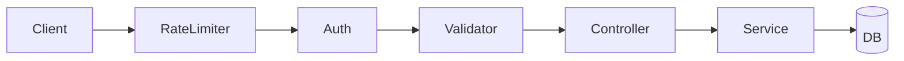

# Zorvyn Backend

Production-ready Express + MongoDB backend for the Zorvyn finance dashboard assignment.

## Setup Instructions

1. Install dependencies
```bash
cd zorvyn-backend
npm install
```

2. Configure environment variables (create `.env` in `zorvyn-backend/`)
```env
MONGO_URI=mongodb://127.0.0.1:27017/zorvyn
JWT_SECRET=your_jwt_secret_min_32_chars
PORT=3000
NODE_ENV=development
```

3. Seed demo data
```bash
npm run seed
```

4. Start server
```bash
npm run dev
```

Production start:
```bash
npm start
```

Base URL:
`http://localhost:3000/api`

## Environment Variables

Required on startup (validated by `src/utils/env-validator.js`):
- `MONGO_URI`
- `JWT_SECRET`
- `PORT`

Optional:
- `NODE_ENV` (`development` | `production`)

## Seed Instructions

Run:
```bash
npm run seed
```

What it does:
- Clears existing `users` and `financialrecords` collections
- Inserts demo users for each role
- Inserts sample financial records

## Default Admin Credentials

After seeding:
- Email: `admin@zorvyn.com`
- Password: `admin123`

Also seeded:
- `analyst@zorvyn.com` / `analyst123`
- `viewer@zorvyn.com` / `viewer123`

## Features Implemented (Submission Checklist Mapping)

### 1) User & Role Management
- Registration and login with JWT
- Roles supported: `ADMIN`, `ANALYST`, `VIEWER`
- Admin APIs to update user role and status
- Route-level + service-level RBAC enforcement

### 2) Financial Records CRUD
- Create record (`POST /records`)
- Read records (`GET /records`, `GET /records/:id`)
- Update record (`PATCH /records/:id`, `PUT /records/:id`)
- Delete record via soft delete (`DELETE /records/:id` -> `isDeleted: true`)
- Every record linked to `userId`

### 3) Record Filtering
- `type` filter
- `category` filter
- Date range (`startDate`, `endDate`)
- Search filter across `notes` and `category` (regex-escaped)
- Pagination (`page`, `limit`, default limit `10`)

### 4) Dashboard Summary APIs
- `GET /dashboard/summary`: total income, total expense, net balance
- `GET /dashboard/trends`: monthly income/expense trend
- `GET /dashboard/trends/weekly`: weekly income/expense trend
- `GET /dashboard/categories`: category/type totals
- `GET /dashboard/recent`: recent activity

### 5) Role-Based Access Control
- Viewer: read-only access to own records and own summary/recent
- Analyst: read access + analytics, scoped to own records
- Admin: full access across users and records

### 6) Validation & Error Handling
- `express-validator` on auth/user/record routes
- Centralized error middleware (`src/middlewares/error.middleware.js`)
- Structured error response:
```json
{
  "success": false,
  "message": "Error message",
  "errors": []
}
```

### 7) Data Persistence
- MongoDB via Mongoose
- Proper schemas for `User` and `FinancialRecord`
- Password hashing in model pre-save hook

## Design Decisions

### Why Service Layer
Controllers stay thin and delegate business logic to services for:
- Separation of concerns
- Easier testability
- Reusability of domain logic

### Why Soft Delete
Records are marked with `isDeleted: true` instead of hard removal to:
- Preserve auditability
- Reduce accidental data loss
- Keep historical integrity for analytics

### Why RBAC
Role checks and ownership checks enforce:
- Data isolation between users
- Principle of least privilege
- Admin-only governance operations

## Performance Notes

Indexing strategy on `FinancialRecord`:
- `{ userId: 1 }`
- `{ date: -1 }`
- `{ type: 1 }`
- `{ userId: 1, date: -1 }`
- `{ userId: 1, type: 1, isDeleted: 1 }`

This improves owner-scoped listing, date sorting, and filtered queries.

## Security Notes

- JWT authentication with expiry
- Helmet security headers enabled
- API rate limiting (`/api`, 500 requests / 15 minutes / IP)
- `express-validator` request validation
- Password hashing with bcrypt
- Inactive users blocked at auth middleware
- Guardrails to prevent removing/deactivating last admin

## Architecture Flow



## API Summary

### Auth
- `POST /auth/register`
- `POST /auth/login`

### Users
- `GET /users/me`
- `PATCH /users/me`
- `GET /users` (ADMIN)
- `GET /users/:id` (ADMIN)
- `PATCH /users/:id/role` (ADMIN)
- `PATCH /users/:id/status` (ADMIN)

### Records
- `GET /records`
- `GET /records/:id`
- `POST /records` (ADMIN)
- `PATCH /records/:id` (ADMIN)
- `PUT /records/:id` (ADMIN)
- `DELETE /records/:id` (ADMIN)

### Dashboard
- `GET /dashboard/summary`
- `GET /dashboard/categories` (ANALYST, ADMIN)
- `GET /dashboard/trends` (ANALYST, ADMIN)
- `GET /dashboard/trends/weekly` (ANALYST, ADMIN)
- `GET /dashboard/recent`

## Scripts

- `npm run dev` - start with nodemon
- `npm start` - start with node
- `npm run seed` - reseed database
- `npm test` - run Jest + Supertest suite

Current automated tests cover:
- Auth login success/failure
- Records RBAC (ANALYST/VIEWER mutation denial)
- Weekly dashboard trends authorization and response
